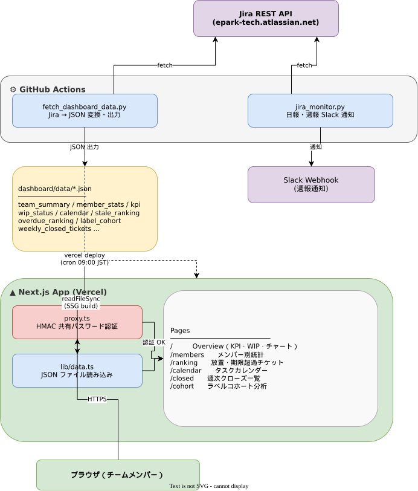

# 運用保守チーム ダッシュボード

Jira のデータを日次で集計し、チームのパフォーマンスを可視化する静的ダッシュボード。

## アーキテクチャ



**技術スタック:**
- **フロント:** Next.js 16 (App Router, SSG) + React 19 + Chart.js + TailwindCSS 4
- **データ取得:** Python 3.12 (Jira REST API, 外部ライブラリ不要)
- **ホスティング:** Vercel (無料プラン, 静的サイト)
- **CI/CD:** GitHub Actions (日次 cron)

## ページ構成

| パス | 内容 |
|------|------|
| `/` | チームKPI進捗（目標vs実績）、WIPアラート、週次クローズ推移、月次リードタイム推移 |
| `/members` | メンバー別の完了数・対応中数の週次推移グラフ |
| `/ranking` | 滞留チケット・期限超過チケットのランキングテーブル |

## データファイル (`dashboard/data/`)

| ファイル | 内容 |
|----------|------|
| `team_summary.json` | チーム全体: 週次クローズ数、月次リードタイム、WIP数 |
| `member_stats.json` | メンバー別: 週次完了数・対応中数 |
| `member_leadtime.json` | メンバー別: 月次リードタイム(平均/中央値) |
| `stale_ranking.json` | 滞留チケット一覧(IN PROGRESS日数順) |
| `overdue_ranking.json` | 期限超過チケット一覧 |
| `wip_status.json` | WIP上限超過状況 |
| `kpi.json` | 半期KPI進捗（週完了数・LT中央値・目標・予測） |
| `meta.json` | 最終更新日時 |

## セットアップ

### 前提条件

- Node.js 20+
- Python 3.12+
- Jira Cloud の API トークン

### 1. ローカル開発

```bash
# リポジトリルート（運用保守_日報週報/）で：

# .env を作成（親ディレクトリに配置）
cp .env.example .env
# .env を編集して以下を設定:
#   JIRA_BASE_URL=https://your-site.atlassian.net
#   JIRA_EMAIL=your@email.com
#   JIRA_API_TOKEN=your-api-token
#   WEEKLY_LABELS=運用保守,運用保守保留案件

# データ取得（Jira APIにアクセス）
python3 fetch_dashboard_data.py

# ダッシュボード起動
cd dashboard
pnpm install
pnpm dev
# → http://localhost:3000 で確認
```

### 2. Vercel デプロイ設定

1. **Vercel でプロジェクト作成**
   - Framework: Next.js
   - Root Directory: `dashboard`

2. **GitHub リポジトリの Secrets 設定**

   | Secret 名 | 値 |
   |-----------|-----|
   | `JIRA_BASE_URL` | `https://your-site.atlassian.net` |
   | `JIRA_EMAIL` | Jira ログインメール |
   | `JIRA_API_TOKEN` | [APIトークン作成](https://id.atlassian.com/manage-profile/security/api-tokens) |
   | `VERCEL_TOKEN` | [Vercel Token](https://vercel.com/account/tokens) |
   | `VERCEL_ORG_ID` | Vercel Settings → General → Your ID |
   | `VERCEL_PROJECT_ID` | Vercel Project Settings → General → Project ID |

3. **GitHub Actions を手動実行して動作確認**
   - Actions → "Dashboard 日次更新" → Run workflow

## アクセス制限（Shared Password）

本番ダッシュボードは **共通パスワード + HMAC 署名 Cookie** による軽量な認証で保護します。パスワードを知っているメンバーが `/login` で入力すると 7日間有効なセッション Cookie が発行されます。

- 実装: `lib/auth.ts` / `proxy.ts` / `app/login/page.tsx` / `app/api/login/route.ts` / `app/api/logout/route.ts`
- Vercel Hobby プランでは Deployment Protection が Production に効かないためアプリ層で実装（EPGPRD-328）
- 追加依存ゼロ（Node 標準 `crypto` のみ）

### セットアップ手順

1. **環境変数を設定**（`.env.example` をコピー）

   | 変数 | 生成/取得方法 | 必須 |
   |------|--------------|------|
   | `DASHBOARD_PASSWORD` | チームで共有するパスワード（強めに） | ✓ |
   | `DASHBOARD_AUTH_SECRET` | `openssl rand -base64 32` — Cookie 署名鍵 | ✓ |

2. **Vercel Project Settings → Environment Variables に上記を登録**（Production / Preview 両方、Sensitive 扱いで）

3. **Vercel の Deployment Protection は OFF** にする（アプリ層で認証するため二重にする必要なし）

### 動作確認

```bash
# ローカル
cp .env.example .env.local && vim .env.local
pnpm dev
# http://localhost:3000 → /login へリダイレクト → パスワード入力 → ダッシュボード表示

# 本番デプロイ後
curl -sI https://daily-dashboard-flax.vercel.app/ | grep -iE '^(HTTP|location)'
# 期待: HTTP/2 307 + location: /login?callbackUrl=...
```

### パスワード変更 / ローテーション

- `DASHBOARD_PASSWORD` を Vercel env で更新 → 再デプロイ（既存 Cookie は署名秘密が同じなら有効のまま）
- 全員を強制ログアウトしたい場合は **`DASHBOARD_AUTH_SECRET` も同時にローテーション**（新しい秘密で署名検証が失敗するため既存 Cookie は無効化される）

### 3. 手動でデータ更新

```bash
# Jira からデータ取得して dashboard/data/ に出力
python3 fetch_dashboard_data.py

# 指定ディレクトリに出力する場合
python3 fetch_dashboard_data.py --out /path/to/output

# ビルドして確認
cd dashboard && npm run build && npm run start
```

## KPI 目標

| KPI | 目標 | 測定方法 |
|-----|------|----------|
| 週完了数 | **9件/週** | `resolved` フィールドで計測、ボードメンバー8名+ラベルフィルタ |
| リードタイム中央値 | **14日以下** | `resolutiondate - created` の中央値 |

目標値は `jira_monitor.py` の `_KPI_TARGET_WEEKLY_CLOSED` / `_KPI_TARGET_LT_MEDIAN` で定義。

## 設定変更

| 変更したい項目 | 変更場所 |
|---------------|----------|
| KPI 目標値 | `jira_monitor.py` の `_KPI_TARGET_*` 定数 |
| ボードメンバー | `config.py` の `BOARD_MEMBER_BASE_JQL` |
| ラベルフィルタ | `.env` の `WEEKLY_LABELS` |
| WIP 上限 | `.env` の `WIP_LIMIT`（デフォルト: 5） |
| データ取得範囲 | `fetch_dashboard_data.py` の `_week_ranges(26)` / `_month_ranges(6)` |

## ディレクトリ構成

```
dashboard/
├── app/
│   ├── page.tsx              # Overview (KPI + WIP + チャート)
│   ├── OverviewCharts.tsx    # クライアント側チャート描画
│   ├── layout.tsx            # 共通レイアウト
│   ├── members/
│   │   ├── page.tsx          # メンバー別ページ
│   │   └── MemberCharts.tsx  # メンバー別チャート
│   └── ranking/
│       └── page.tsx          # ランキングテーブル
├── components/
│   ├── Charts.tsx            # Bar/Line チャートラッパー
│   └── Nav.tsx               # ナビゲーション
├── lib/
│   └── data.ts              # JSONデータローダー + 型定義
├── data/                     # ← fetch_dashboard_data.py が出力
│   └── .gitkeep
└── .github/workflows/
    └── update-dashboard.yml  # 日次更新 CI
```
